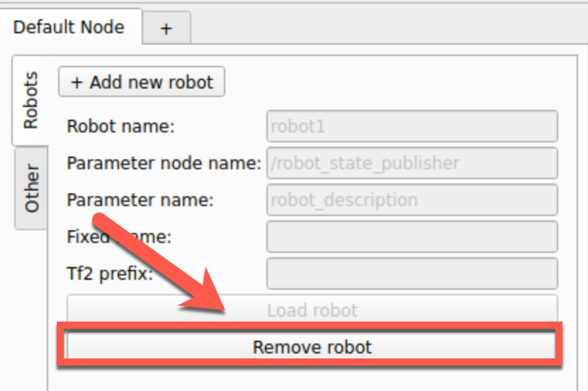

"""""""""""""""""""
Robot Visualization
"""""""""""""""""""

========
Overview
========

For the robot visualization in 3D Slicer, one first need to properly
configure a robot in ROS 2. The default ROS approach requires:

* an XML robot definition file (``UFA``) and usually CAD files for
  the links.

* a robot state publisher node which will make the URDF description
  available as a ROS parameter for other nodes.  The robot state
  publisher will also compute the forward kinematics and broadcast the
  3D position of each link to tf2.

* a source (publisher) for the current joint positions.  This can be
  an actual robot driver or a script emulating the robot.

Before testing SlicerROS2, you should always check that your setup is
correct and works with RViz.

Once the ROS robot is setup properly, the SlicerROS2 robot node can be
used to visualize the robot in Slicer.  Internally, the robot node
will use a parameter node to retrieve the URDF description and tf2
lookups to refresh the position of each link.

.. note::

   VTK can import ``.stl`` and ``.obj`` meshes.  If your model uses
   other CAD formats, the robot will be created in Slicer but it will
   not show-up.

=========
ROS Robot
=========

The following are examples of robots we've used to test the SlicerROS2
module. They can be used without the actual hardware if you just want
to try SlicerROS2.

They cover serial robots (Phantom Omni and Cobot) as well as a robot
with parallel linkages (dVRK PSM).  The SlicerROS2 module should work
with any other robots as long as the links CAD files are either
``.stl`` or ``.obj``.

Phantom Omni
============

The Phantom Omni is an entry level haptic device initially sold by
Sensable.  Later on, it has been renamed Geomagic Touch or 3DS Touch.
The initial version used a FireWire connection.  Later models used
Ethernet and more recently USB.

.. image:: /images/sensable-omni.png
  :width: 400
  :align: center
  :alt: Sensable Omni in Slicer

We created and used a ROS package for the Phantom Omni: `Omni Github
Link <https://github.com/jhu-saw/ros2_sensable_omni_model>`_.  This
package has no external dependencies and is very light so it's a good
way to test the SlicerROS2 module.  You can download this repository
in your ROS 2 workspace's source directory and then build.  Always
remember to use ``colcon build`` followed by ``source
install/setup.bash`` when you downloaded a new package to ``src``.

This package contains the URDF, STL meshes, a launch file for the
``robot_state_publisher`` as well as a dummy script that publishes a
joint trajectory so one can see the arm moving around.

To start the ``robot_state_publisher``, use:

.. code-block:: bash

  ros2 launch sensable_omni_model omni.launch.py

Then, to start the robot's dance, use an other terminal:

.. code-block:: bash

  ros2 run sensable_omni_model pretend_omni_joint_state_publisher

dVRK PSM
========

The dVRK PSM (`da Vinci Research
Kit <https://dvrk.readthedocs.io/>`_
Patient Side Manipulator) is based on the first generation da Vinci
RAMIS system (Robotically Assisted Minimally Invasive Surgery) sold by
ISI (`Intuitive Surgical systems <https://www.intuitive.com/>`_).

.. image:: /images/dVRK-PSM.png
  :width: 400
  :align: center
  :alt: dVRK PSM in Slicer

Installing the dVRK code base is not too difficult but it will take a
few minutes to compile.  You can find the build instructions for ROS 2
ins the `dVRK manual
<https://dvrk.readthedocs.io/en/latest/pages/software/compilation/ros2.html>`_.

Once you've compiled all the dVRK related packages, you can use the arm launch file:

.. code-block:: bash

   source ~/ros2_ws/install/setup.bash
   ros2 launch dvrk_model arm.launch arm:=PSM1 generation:=Classic

.. note::

   You don't need to compile the full dVRK stack if you just want to
   display a dVRK arm.  You can build the package
   https://github.com/jhu-dvrk/dvrk_model in your ROS workspace and
   then use the command line: ``ros2 launch dvrk_model arm.launch
   arm:=PSM1 generation:=Classic simulated:=False``.

Cobot
=====

We also tested SlicerROS2 on `myCobot by Elephant Robotics
<https://www.elephantrobotics.com/en/mycobot-en/>`_, specifically the
myCobot 280 M5 Stack.  The ROS 2 interface for the device can be found
`here <https://github.com/elephantrobotics/mycobot_ros2>`_ and drivers
can be installed from the Elephant Robotics website.

Assuming the interface (mycobot_ros2) is cloned under the same
``ros2_ws``, the state publisher can be started using the following steps:

.. code-block:: bash

  cd ~/ros2_ws/src/mycobot_ros2/src/mycobot_ros2/mycobot_280/mycobot_280/config
  python3 listen_real.py

It's possible that you will need to change the port specified on line
14 of ``listen_real.py`` depending on your device.  The ``.dae`` files
in the robot description also need to be converted to STLs (an online
converter will work) and the paths in the URDF file should be updated
to reflect this change.

Once running - make sure your robot is in *Transponder Mode*. More
instructions for basic operation of the myCobot can be found in the
`Gitbook
<https://docs.elephantrobotics.com/docs/gitbook-en/2-serialproduct/2.1-280/2.1-280.html>`_

============
Slicer Robot
============

.. _load_robot:

Adding and removing robots
==========================

We've simplified loading the robot by adding some shortcuts on the
widget UI. The default parameter node name: ``/robot_state_publisher``
and parameter name: ``robot_description`` should work for most
cases. These are set as the default in the UI. To load a robot with
these parameters, press the "Load Robot" button:

.. image:: /images/LoadRobot.png
  :width: 300
  :align: center
  :alt: Defining a robot in Slicer

At that point, the robot's model should be loaded and displayed in
Slicer. To do this addition programmatically, please see the
documentation on the ``vtkMRMLROS2RobotNode``. Note that if your robot
uses a namespace, you will likely need to prefix this on the parameter
node name. The PSM for example requires
``PSM1/robot_state_publisher``.

To remove the robot from the scene you can press the "Remove Robot"
button.

To add more than one robot, you can press the "+" button and the
widget will update with additional line edits for the second robot.

.. image:: /images/AddRobot.png
  :width: 300
  :align: center
  :alt: Defining a robot with a namespace in Slicer

Tips and tricks
===============

Fixed frame
-----------

All cartesian poses used to display the robot's links are defined with
respect to a base frame, also know as "Fixed Frame" in RViz. The
default in RViz is "map". This default is often ignored in URDFs. When
the "fixed frame" is not correctly defined, you will get some warnings
regarding lookups in Tf2 not found. For example, the Phantom Omni URDF
uses the reference frame ``base``.

The UI for SlicerROS2 robot also has a field to specify the fixed
frame of the robot. The default behaviour is to use the first link of
the robot as the fixed frame if this field is left empty. For
non-holonomic robots, this feature may be necessary for
visualization. The example below shows a rendering of the TurtleBot in
3D Slicer using this feature.

.. image:: /images/turtlebot.gif
  :width: 800
  :align: center
  :alt: Defining a robot with a namespace in Slicer

.. hint::

   To help figuring out the frames currently declared, you can also
   use ``ros2 run tf2_tools view_frames`` once the robot is launched
   (see `ROS documentation
   <https://docs.ros.org/en/jazzy/Tutorials/Intermediate/Tf2/Debugging-Tf2-Problems.html>`_).

ROS namespaces
--------------

Namespaces are frequently used for ROS applications. They allow users
to declare multiple robots with the same topic, service, tf... names
without conflicts. For example, the joint state publisher use the
topic ``/joint_states`` by convention. If you have multiple robots,
you can use a namespace to isolate the topic.  For example, the
Phantom Omni package uses the the namespace ``/arm`` and the joint
state topics becomes ``/arm/joint_states``. If you are unsure which
namespaces are used, you can list all the current ROS topics using
``ros2 topic list``.

To set a namespace on an existing node (for example ``/arm``), you can
use the option ``--ros-args --remap __ns:=/arm``.

.. warning::

   When you specify a namespace using the command line, make sure to
   remove any trailing slash.  The following won't work:
   ``--ros-args --remap __ns:=/arm/``
