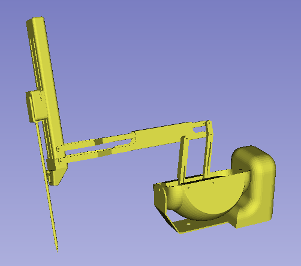

"""""""""""""""""""
Robot Visualization
"""""""""""""""""""

========
Overview
========

For the robot visualization in Slicer 3D, one first need to properly
configure a robot in ROS 2.  The default ROS approach requires:

* an XML robot definition file (``URDF``) and usually CAD files for
  the links.

* a robot state publisher node which will make the URDF description
  available as a ROS parameter for other nodes.  The robot state
  publisher will also compute the forward kinematics and broadcast the
  3D position of each link to tf2.

* a source (publisher) for the current joint positions.  This can be
  an actual robot driver or a script emulating the robot.

Once the ROS robot is setup properly, the SlicerROS2 robot node can be
used to visualize the robot in Slicer.  Internally, the robot node
will use a parameter node to retrieve the URDF description and tf2
lookups to refresh the position of each link.

=========
ROS Robot
=========

The following are examples of robots we've used to test the SlicerROS2
module.  They cover a serial robot (Phantom Omni) as well as a robot
with parallel linkages (dVRK PSM).  The SlicerROS2 module should work
with any other robots as long as the links CAD files are either
``.stl`` or ``.obj``.

Phantom Omni
============

The Phantom Omni is an entry level haptic device initially sold by
Sensable.  Later on, it has been renamed Geomagic Touch or 3DS Touch.
The intial version used a FireWire connection.  Later models used
Ethernet and more recently USB.

We created and used a ROS package for the Phantom Omni: `Omni Github
Link <https://github.com/jhu-saw/ros2_sensable_omni_model>`_.  This
package has no external dependencies and is very light so it's a good
way to test the SlicerROS2 module.  You can download this repository
in your ROS 2 workspace's source directory and then build.  Always
remember to use ``colcon build`` followed by ``source
install/setup.bash`` when you downloaded a new package to ``src``.

This package contains the URDF, STL meshes, a launch file for the
``robot_state_publisher`` as well as a dummy script that publishes a
joint trajectory so one can see the arm moving around.

To start the ``robot_state_publisher``, use:

.. code-block:: bash

  ros2 launch sensable_omni_model omni.launch.py

Then, to start the robot's dance, use an other terminal:

.. code-block:: bash

  ros2 run sensable_omni_model pretend_omni_joint_state_publisher

dVRK PSM
========

The dVRK PSM (`da Vinci Research
Kit <https://github.com/jhu-dvrk/sawIntuitiveResearchKit/wiki/>`_
Patient Side Manipulator) is based on the first generation da Vinci
RAMIS system (Robotically Assisted Minimally Invasive Surgery) sold by
ISI (`Intuitive Surgical systems <https://www.intuitive.com/>`_).

Installing the dVRK code base is not too difficult but it will take a
few minutes to compiled.  You can find the build instructions for ROS
2 on the `dVRK Wiki
<https://github.com/jhu-dvrk/sawIntuitiveResearchKit/wiki/BuildROS2>`_.

Once you've compiled all the dVRK related packages, you will need 3 terminals to launch the following nodes:

.. code-block:: bash

  # simulated PSM
  ros2 run dvrk_robot dvrk_console_json -j ~/ros2_ws/src/cisst-saw/sawIntuitiveResearchKit/share/console/console-PSM1_KIN_SIMULATED.json

  # robot state publisher
  ros2 launch dvrk_model dvrk_state_publisher.launch.py arm:=PSM1

  # test script, make the PSM1 move around
  ros2 run dvrk_python dvrk_arm_test.py -a PSM1

Cobot
=====

We also tested SlicerROS2 on `myCobot by Elephant Robotics
<https://www.elephantrobotics.com/en/mycobot-en/>`_, specifically the
myCobot 280 M5 Stack.  The ROS 2 interface for the device can be found
`here <https://github.com/elephantrobotics/mycobot_ros2>`_ and drivers
can be installed from the Elephant Robotics website.

Assuming the interface (mycobot_ros2) is cloned under the same
``ros2_ws``, the state publisher can be started using the following steps:

.. code-block:: bash

  cd ~/ros2_ws/src/mycobot_ros2/src/mycobot_ros2/mycobot_280/mycobot_280/config
  python3 listen_real.py

It's possible that you will need to change the port specified on line
14 of ``listen_real.py`` depending on your device.  The ``.dae`` files
in the robot description also need to be converted to STLs (an online
converter will work) and the paths in the URDF file should be updated
to reflect this change.

Once running - make sure your robot is in *Transponder Mode*. More
instructions for basic operation of the myCobot can be found in the
`Gitbook
<https://docs.elephantrobotics.com/docs/gitbook-en/2-serialproduct/2.1-280/2.1-280.html>`_

============
Slicer Robot
============

The defaults ``/robot_state_publisher`` and ``robot_description`` should work
for most cases so leave these as-is too.

At that point, the robot's model should be loaded and displayed in Slicer.

The PSM1 uses a namespace.

